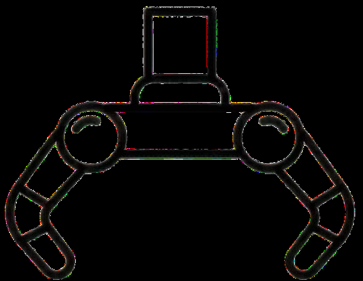
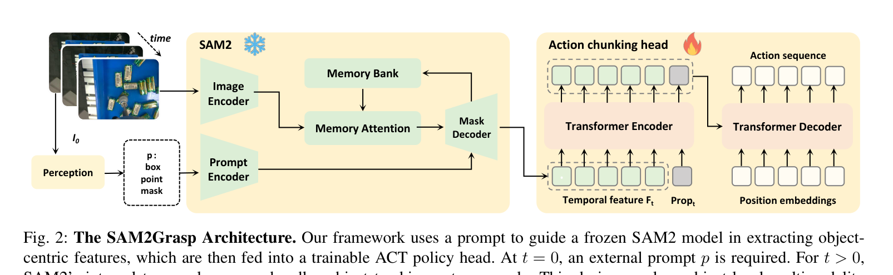
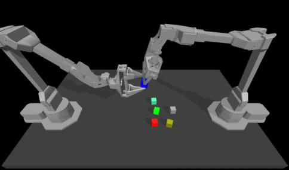
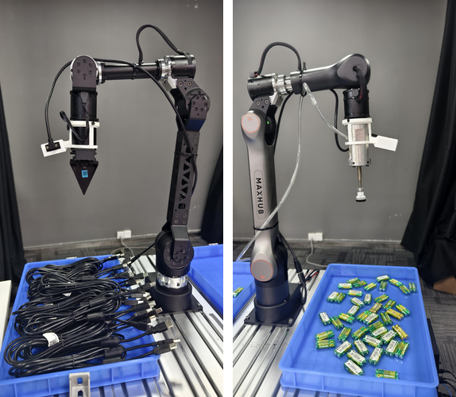
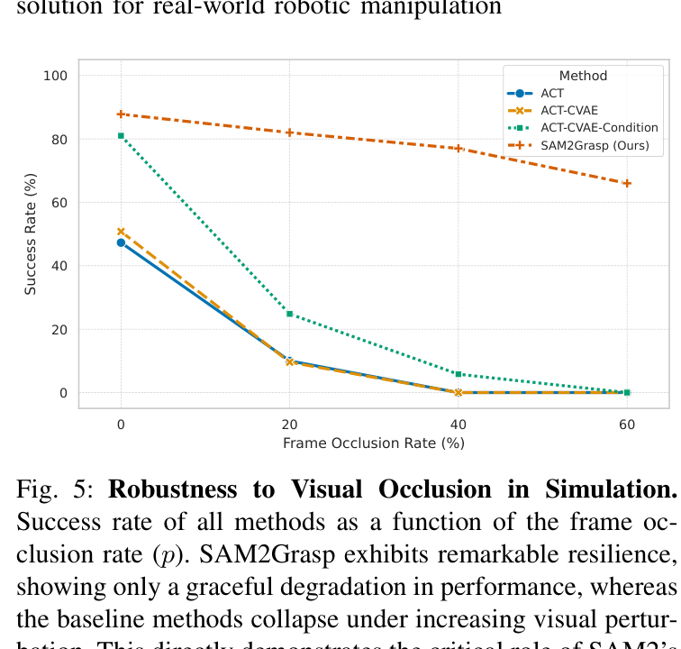

# SAM2Grasp：通过提示条件化时序动作预测解决多模态抓取  
# SAM2Grasp: Resolve Multi-modal Grasping via Prompt-conditioned Temporal Action Prediction

> **文档说明：** 在 [`sam2grasp_zh_en.md`](sam2grasp_zh_en.md) 全文中英对照基础上，插入 **act_robot** 代码互释（论文 ↔ 实现）。  
> 图仍见 `assets/sam2grasp/`；代码块为仓库摘录（可能略去无关行）。  
> **arXiv:** [2512.02609](https://arxiv.org/abs/2512.02609)｜**code root:** `act_robot/`

**Authors / 作者：** Shengkai Wu¹, Jinrong Yang, Wenqiu Luo, Linfeng Gao, Chaohui Shang, Meiyu Zhi, Mingshan Sun, Fangping Yang, Liangliang Ren, and Yong Zhao\*

- \*Corresponding author / 通讯作者：zhaoyong11933@cvte.com  
- ¹First author / 第一作者：wushengkai@cvte.com  
- All authors are with CVTE, Guangzhou, China. / 作者单位：CVTE（广州）

---

## Abstract / 摘要

**EN:** Imitation learning for robotic grasping is often plagued by the multimodal problem: when a scene contains multiple valid targets, demonstrations of grasping different objects create conflicting training signals. Standard imitation learning policies fail by averaging these distinct actions into a single, invalid action. In this paper, we introduce SAM2Grasp, a novel framework that resolves this issue by reformulating the task as a uni-modal, prompt-conditioned prediction problem. Our method leverages the frozen SAM2 model to use its powerful visual temporal tracking capability and introduces a lightweight, trainable action head that operates in parallel with its native segmentation head. This design allows for training only the small action head on pre-computed temporal-visual features from SAM2. During inference, an initial prompt, such as a bounding box provided by an upstream object detection model, designates the specific object to be grasped. This prompt conditions the action head to predict a unique, unambiguous grasp trajectory for that object alone. In all subsequent video frames, SAM2’s built-in temporal tracking capability automatically maintains stable tracking of the selected object, enabling our model to continuously predict the grasp trajectory from the video stream without further external guidance. This temporal-prompted approach effectively eliminates ambiguity from the visuomotor policy. We demonstrate through extensive experiments that SAM2Grasp achieves state-of-the-art performance in cluttered, multi-object grasping tasks.

**ZH:** 机器人抓取中的模仿学习常受**多模态问题**困扰：当场景中存在多个合法目标时，抓取不同物体的演示会形成相互冲突的训练信号。标准模仿学习策略往往会把这些不同动作“平均”成一个无效动作。本文提出 **SAM2Grasp**，将任务重写为**单模态、提示条件化**的预测问题。方法利用**冻结的 SAM2** 发挥其强大的视觉时序追踪能力，并引入与原生分割头并行的轻量可训动作头，从而只需在 SAM2 预计算的时序视觉特征上训练动作头。推理时，由上游目标检测给出的初始提示（如边界框）指定要抓的物体；该提示条件化动作头，使其仅对该物体预测唯一、无歧义的抓取轨迹。在后续视频帧中，SAM2 内置时序追踪自动维持对所选物体的稳定跟踪，无需额外外部引导即可持续预测抓取轨迹。这种“时序提示”方式有效消除了视觉运动策略中的歧义。大量实验表明，SAM2Grasp 在杂乱、多物体抓取任务上达到先进水平。


---

## 0. 本仓库对照总览 / Repository Mapping Overview

**EN:** This annotated edition keeps the bilingual paper text and inserts **act_robot** implementation snippets so the paper and code explain each other. The table below is the quick map.

**ZH:** 本注解版保留论文中英对照正文，并在合适位置插入 **act_robot** 代码片段，使论文与实现互相解释。下表为速查映射。

| Paper concept / 论文概念 | act_robot files / 仓库文件 | Role / 作用 |
| --- | --- | --- |
| Frozen SAM2 → \(F_t\) (offline) | `sam2_features.py` `SAM2FeatureExtractor`, `extract_sam2_features.py` | Stage-1: cache features to HDF5 |
| Frozen SAM2 → \(F_t\) (online) | `sam2_features.py` `SAM2StreamingFeatureExtractor`, `serve.py` | Inference: bbox then streaming track |
| ACT head \(h_{\mathrm{action}}(F_t, Prop_t)\) | `detr/models/act_sam2.py` `ACTSAM2`, `policy.py` `ACTSAM2Policy` | Trainable chunk predictor + L2 |
| Paper-aligned CVAE ACT | `detr/models/act_sam2_cvae.py`, `ACTSAM2CVAEPolicy` | Optional `--use-cvae` |
| Dataset \(D'=\{(F_t,a^*_t)\}\) | `dataset.py` `SAM2EpisodicDataset` | Load cached `sam2_feat` + qpos/action |
| Stage-2 training | `train.py --use-sam2-features` | Train only ACT head |
| Wire protocol + closed loop | `serve.py` `_handle_sam2_client` | refresh=1 + 16B bbox |

**Repo vs paper gaps / 实现与论文差异（阅读代码时请注意）：**

1. **Camera:** 本仓库 SAM2 路径只用腕部 `rgb_wrist_1`（单相机），不是多相机 ResNet 基线。
2. **Async dual-thread:** 论文 §III.D 的推理/控制双线程 + 时序集成；`serve.py` 当前以 **chunk replay** 为主（`ClientState`），`--temporal-agg` 相关逻辑存在但默认未启用完整异步环。
3. **Offline vs streaming \(F_t\):** 训练用 `propagate_in_video` 整段抽取；线上用逐帧 streaming，存在已知数值漂移（见 README）。


---

## I. Introduction / 引言

**EN:** Learning robotic policies from demonstration, often formulated as a supervised regression task of mapping observations to actions, is a compelling paradigm for acquiring complex visuomotor skills. In practice, however, predicting robot actions presents unique challenges, chief among them being the inherent multi-modality of action distributions. This problem is ubiquitous in grasping, where, for example, a single observation containing several objects affords multiple, equally valid actions, as depicted in Figure 1(a). When trained on such data, a standard behavioral cloning policy fails by predicting the “average” of distinct expert actions—a physically meaningless command that grasps empty space, as illustrated in Figure 1(b).

**ZH:** 从演示中学习机器人策略（常表述为观测到动作的有监督回归）是获取复杂视觉运动技能的有力范式。但实践中预测机器人动作面临独特挑战，首要的是动作分布固有的**多模态性**。抓取中尤为普遍：例如同一观测中含有多个物体时，可对应多个同等合法的动作（见图 1(a)）。在这类数据上训练时，标准行为克隆策略会失败于预测不同专家动作的“平均”——一个物理上无意义、去抓空地的指令（见图 1(b)）。

**EN:** Prior work has largely focused on tackling this challenge by engineering more expressive policy representations capable of modeling this complexity. These strategies include explicitly modeling a multi-modal output with mixture of Gaussians [3], or switching to implicit policy representations via generative models like CVAE [15] and Diffusion Models [2] to better capture the diverse distribution of expert behaviors. While effective, these methods inherently ask the policy to manage the ambiguity, adding significant complexity to the learning problem.

**ZH:** 已有工作大多通过设计更具表达力的策略表示来建模这种复杂性，例如用高斯混合显式建模多模态输出 [3]，或改用 CVAE [15]、扩散模型 [2] 等生成式隐式策略以刻画专家行为的多样分布。这些方法虽有效，但本质上仍让**策略本身**去处理歧义，显著增加了学习难度。



**Fig. 1 / 图 1：** The Multi-modality Problem in Imitation Learning and Our Approach. / 模仿学习中的多模态问题与本文方法。(a) 同一观测下多合法目标时，专家演示可多模态（如抓左或抓右）。(b) 标准 BC 因“模态平均”失败，预测指向物体之间空地的无意义动作。(c) SAM2Grasp 通过额外提示指定目标，将多模态问题转为单模态，从而输出正确且无歧义的动作。


> **【代码互释 / Code annotation】** 论文 Fig.1：标准 BC 模态平均 vs 提示条件化。本仓库两条互斥管线对应这一对比。

```python
# train.py — choose ResNet-ACT (no object prompt) vs SAM2Grasp (prompted F_t)
# Baseline: ACTPolicy(image, qpos)  — object-level multimodality left to the policy
# SAM2:     ACTSAM2Policy(sam2_feat, qpos) — F_t already object-centric via bbox prompt
parser.add_argument('--use-sam2-features', action='store_true',
                    help='Train ACT head from pre-extracted F_t (extract_sam2_features.py).')
```

**ZH:** 不加 `--use-sam2-features` 时走多相机 ResNet `ACTPolicy`（Fig.1(b) 一类“策略自己消歧”）；加上后走冻结 SAM2 的 \(F_t\) + `ACTSAM2Policy`（Fig.1(c)）。


**EN:** This paper presents a fundamentally different strategy: we resolve ambiguity at the perception stage rather than modeling it at the action stage. As shown in Figure 1(c), we introduce SAM2Grasp, a framework that conditions the policy on a single, explicit target via a prompt. This simple but powerful idea transforms the intractable multi-modal problem into a well-defined, uni-modal one. We realize this approach by leveraging a powerful, pre-trained foundation model, the Segment Anything Model 2 (SAM2) [6]. Its built-in capabilities for promptable, temporal-aware tracking provide the perfect tool to eliminate ambiguity upfront, thus dramatically simplifying the downstream policy learning task.

**ZH:** 本文采取根本不同的策略：**在感知阶段消解歧义**，而非在动作阶段去建模歧义。如图 1(c) 所示，我们提出 SAM2Grasp：用提示将策略条件化到单一显式目标上。这一简单而有力的想法把难解的多模态问题变成定义清晰的单模态问题。我们借助强大的预训练基础模型 **SAM2** [6] 实现该思路；其可提示、时序感知的追踪能力能在上游消除歧义，从而大幅简化下游策略学习。

**EN:** Our architecture, which integrates a frozen SAM2 backbone with a lightweight ACT policy head, is intentionally designed for efficiency. This choice unlocks a remarkably efficient training paradigm. Instead of costly end-to-end training, we perform a single offline pass to extract and cache rich temporal-visual features from SAM2 across our entire demonstration dataset. Subsequently, only the action head is trained to map these powerful, pre-computed features to grasp trajectories. This approach avoids the immense computational cost and data requirements of fine-tuning the large foundation model.

**ZH:** 架构上将**冻结的 SAM2 骨干**与轻量 **ACT 策略头**结合，刻意面向高效。由此得到极为高效的训练范式：不必昂贵的端到端训练，而是对整集演示做一次离线前向，抽取并缓存 SAM2 的丰富时序视觉特征；随后**只训练动作头**，把预计算特征映射为抓取轨迹，避免对大基础模型微调的巨大算力与数据需求。

**EN:** At inference time, SAM2Grasp operates as a robust, closed-loop policy. An initial prompt such as a bounding box from an upstream module specifies the target object. The model then leverages SAM2’s temporal tracking capabilities to autonomously follow the designated object across subsequent video frames, continuously refining its trajectory without requiring further prompts. This “temporal-prompted” execution transforms the policy’s task from a multi-choice problem into a deterministic, conditioned execution, ensuring robust performance even under visual occlusion.

**ZH:** 推理时，SAM2Grasp 作为稳健的闭环策略运行：上游模块给出的初始提示（如边界框）指定目标；模型随后利用 SAM2 的时序追踪在后续帧中自主跟随该物体，持续细化轨迹且无需再给提示。这种“时序提示”执行把策略任务从多选问题变为确定性的条件执行，即便在视觉遮挡下也保持稳健。

**EN:** Our contributions are:

- We introduce SAM2Grasp, a novel framework that resolves object-level multimodality in robotic grasping by reformulating it as a prompt-conditioned, uni-modal problem.
- We propose an efficient architecture that deeply integrates a frozen, temporal-aware foundation model (SAM2) with an ACT policy, demonstrating a powerful paradigm of decoupling perception from control.
- We present extensive experiments showing that SAM2Grasp not only achieves state-of-the-art performance but also exhibits robustness to severe visual occlusions, dramatically outperforming SOTA baselines.

**ZH:** 本文贡献如下：

- 提出 SAM2Grasp：将物体级多模态抓取重写为提示条件化的单模态问题。
- 提出高效架构：深度融合冻结的时序感知基础模型（SAM2）与 ACT 策略，展示感知与控制解耦的范式。
- 通过大量实验表明：SAM2Grasp 不仅达到先进性能，且对严重视觉遮挡具有鲁棒性，显著优于现有先进基线。

---

## II. Related Work / 相关工作

### A. Imitation Learning for Robotic Grasping / 机器人抓取中的模仿学习

**EN:** Imitation learning (IL) and its most direct form, Behavioral Cloning (BC) [9], cast robot skill acquisition as a supervised learning problem mapping observations to actions. Subsequent research has significantly advanced this paradigm. A major thrust has been to improve policy architectures to better incorporate history, evolving from simple feed-forward networks to Transformer-based models that capture long-term dependencies in sensorimotor data [12]. Another direction focuses on enhancing the versatility of IL, leveraging language for multi-task learning [11], [10], [16], [13], [21], [17] or scaling with massive datasets to achieve impressive generalization [12], [22], [27], [28]. In addition, high-quality demonstration data is important for IL training and some works have explored the rules to collect high-quality data, such as HD-Space [31] and ADC [32]. However, a fundamental challenge persists: when trained on expert data containing multiple valid but distinct behaviors for the same observation (e.g., grasping different objects), these end-to-end policies suffer from the catastrophic mode-averaging problem. Our work directly targets this critical limitation within the end-to-end learning paradigm.

**ZH:** 模仿学习（IL）及其最直接形式行为克隆（BC）[9] 将机器人技能获取表述为观测到动作的监督学习。后续研究显著推进了该范式：一方面改进策略架构以更好利用历史，从简单前馈网络发展到能捕捉传感运动数据长期依赖的 Transformer [12]；另一方面增强 IL 通用性，借助语言做多任务学习 [11][10][16][13][21][17]，或用大规模数据实现强泛化 [12][22][27][28]。高质量演示数据对 IL 训练也很关键，已有工作探讨高质量采集规则，如 HD-Space [31]、ADC [32]。但根本挑战仍在：当同一观测对应多种合法但不同的专家行为（如抓不同物体）时，端到端策略会遭受灾难性的**模态平均**。本文直接针对端到端范式中的这一关键局限。

### B. Addressing Multi-modality in Imitation Learning / 处理模仿学习中的多模态

**EN:** The fundamental multi-modality problem in IL has inspired two distinct strategic directions. The first focuses on modeling ambiguity in action distribution. This is typically achieved with generative models, ranging from Conditional Variational Autoencoders (CVAEs) [15], as used in the original Action Chunking Transformer (ACT) [7], to more powerful Diffusion Models [2] like in Diffusion Policy [1]. A second, emerging strategy resolves ambiguity at the policy input by providing an explicit target condition. This is often done by augmenting the policy’s observation with target-specific information, such as a target’s mask [29] or a cropped image of the target object [30]. While this visual cueing is more effective, it still requires a standard vision backbone to learn the difficult task of correlating this cue with the main visual stream from scratch. Our work, SAM2Grasp, advances this second strategy to a new level of integration and efficiency. Instead of merely concatenating a condition to the input, we leverage the built-in promptable and temporal-aware capabilities of the frozen SAM2 model, which allows us to extract clean, object-centric features that are already filtered from background clutter before they reach the policy. As our experiments demonstrate, this prompt-driven perception is fundamentally more robust than simple input conditioning, as it offloads the entire complex task of conditioned perception and tracking to a specialized, pre-trained expert.

**ZH:** IL 中的多模态问题催生了两条不同策略。第一条侧重在**动作分布**中建模歧义，通常用生成模型：从原始 ACT [7] 所用的 CVAE [15]，到 Diffusion Policy [1] 等更强的扩散模型 [2]。第二条新兴策略在**策略输入**侧用显式目标条件消解歧义，常见做法是把目标 mask [29] 或目标裁剪图 [30] 等拼进观测。视觉提示虽更有效，但仍需标准视觉骨干从零学习把提示与主视觉流关联起来。SAM2Grasp 把第二条策略推进到更深融合与更高效率：不是简单拼接条件，而是利用冻结 SAM2 内置的可提示、时序感知能力，在特征到达策略之前就抽出已从背景杂波中滤净的物体中心特征。实验表明，这种提示驱动感知比简单输入条件化更稳健，因为把条件感知与追踪的复杂工作卸载给了专门预训练的专家模型。


> **【代码互释】** 论文对比“输出侧多模态建模（CVAE）”与“输入侧条件化”。仓库同时提供确定性头与可选 CVAE 头，但 **SAM2 路径的条件化来自 bbox→\(F_t\)**，不是把框画进 RGB。

```python
# train.py
if args.use_cvae:
    policy = ACTSAM2CVAEPolicy(policy_config)  # L1 + KL (paper-aligned ACT)
else:
    policy = ACTSAM2Policy(policy_config)      # plain L2 on chunks (default SAM2Grasp-style)
```


### C. Foundation Models for Robotic Manipulation / 机器人操作中的基础模型

**EN:** The rise of large-scale, pre-trained foundation models [34], [35], [6] has created a paradigm shift in robotics. Vision-Language Models (VLMs) [4], [19], [20], [23] have enabled robots to follow natural language instructions [11], [10]. In addition, the Segment Anything Model (SAM) [5] and its successor SAM2 [6] introduced promptable segmentation, providing a powerful tool for zero-shot object perception, which is important for robotic manipulation. For example, SAM2Act [18] introduced SAM2 into a 3D-based robotic policy for high precision and generalizability. Theia [24] distills diverse vision foundation models such as SAM [5], Depth-Anything [25] for robot learning. Our work distinguishes them by deeply integrating a temporal-aware foundation model not as a mere perception module, but as a core, frozen component of the visuomotor policy itself. Instead of just using its final segmentation mask, we harness its rich internal features and built-in temporal tracking capabilities to directly drive action prediction. This deep integration allows us to create a highly efficient yet powerful policy that inherits the immense knowledge of the foundation model without the need for costly fine-tuning.

**ZH:** 大规模预训练基础模型 [34][35][6] 正在改变机器人学范式。视觉–语言模型（VLM）[4][19][20][23] 使机器人能遵循自然语言指令 [11][10]。SAM [5] 及其后继 SAM2 [6] 引入可提示分割，为零样本物体感知提供有力工具，对操作任务很重要。例如 SAM2Act [18] 将 SAM2 引入基于 3D 的机器人策略以提升精度与泛化；Theia [24] 蒸馏 SAM、Depth-Anything [25] 等视觉基础模型用于机器人学习。本文与它们的区别在于：把时序感知基础模型**深度集成**为视觉运动策略的核心冻结组件，而非仅作感知模块；不只用最终分割 mask，而是利用其丰富内部特征与内置时序追踪直接驱动动作预测。如此可继承基础模型知识，又无需昂贵微调，得到高效且强大的策略。

---

## III. Method / 方法

**EN:** Our goal is to develop a robust and efficient imitation learning framework for robotic grasping that resolves the fundamental multi-modality problem when grasping multiple objects. Our key insight is to reframe the task: instead of learning a complex multi-modal policy, we learn a simple, uni-modal policy conditioned on a target-object prompt. We achieve this by building upon a frozen, pre-trained temporal-aware foundation model, SAM2 [6]. This section details our problem formulation, the SAM2Grasp architecture, our highly efficient training paradigm, and the inference-time execution pipeline.

**ZH:** 目标是构建稳健且高效的抓取模仿学习框架，解决多物体抓取中的基本多模态问题。关键洞察是改写任务：不学复杂多模态策略，而学由目标物体提示条件化的简单单模态策略，并建立在冻结、预训练的时序感知基础模型 SAM2 [6] 之上。本节给出问题形式化、SAM2Grasp 架构、高效训练范式与推理执行流程。

### A. Problem Formulation / 问题形式化

**EN:** Standard Behavioral Cloning (BC) aims to learn a policy \(\pi\) that minimizes a loss function between its predicted action \(a_t\) and an expert’s action \(a^*_t\) from a demonstration dataset \(D = (s_t, a^*_t)\). However, this formulation faces significant challenges in robotic grasping due to the inherent multi-modality of expert data.

**ZH:** 标准行为克隆（BC）希望学策略 \(\pi\)，使预测动作 \(a_t\) 与演示数据集 \(D=(s_t,a^*_t)\) 中专家动作 \(a^*_t\) 的损失最小。但因专家数据固有多模态，该形式在抓取中面临严峻挑战。

**EN:** The multi-modality problem in robotic grasping manifests in at least two distinct ways:

- **Object-level multimodality:** Given multiple graspable objects, which one should be the target? Demonstrations where experts grasp different objects from the same initial scene create conflicting data pairs \((s_t, a^*_{t,1})\) and \((s_t, a^*_{t,2})\), where \(a^*_{t,1} \neq a^*_{t,2}\).
- **Action-level multimodality:** For a single target object, how should it be grasped? An expert may demonstrate various valid grasp poses (e.g., top-down grasp, side grasp), creating a multi-modal distribution even for a single target.

**ZH:** 抓取中的多模态至少表现为两类：

- **物体级多模态：** 多个可抓物体时该抓哪一个？同一初始场景下专家抓不同物体，会形成冲突数据对 \((s_t,a^*_{t,1})\) 与 \((s_t,a^*_{t,2})\)，且 \(a^*_{t,1}\neq a^*_{t,2}\)。
- **动作级多模态：** 对同一目标如何抓？专家可能演示多种合法抓姿（如自上而下、侧抓），即使单目标也呈多模态分布。

**EN:** While both are valid challenges, the object-level multi-modality is particularly detrimental for standard BC. Training a deterministic policy on such data leads to mode averaging, often resulting in a physically nonsensical trajectory that targets the empty space between objects. Our work explicitly addresses this object-level multimodality.

**ZH:** 两类挑战都成立，但对标准 BC 尤其致命的是**物体级多模态**：在确定性策略上训练会导致模态平均，常得到指向物体之间空地的无意义轨迹。本文明确针对物体级多模态。

**EN:** We reformulate the problem by introducing an object-specifying prompt, \(p\), as an additional condition for the policy. The policy’s task becomes learning the mapping \(\pi(a_t \mid s_t, p)\). The prompt \(p\) (e.g., a bounding box provided by an object detection model) uniquely identifies a target object \(o_i\) within the scene. For any given pair of \((s_t, p)\), the corresponding expert action \(a^*_t\) is now assumed to be uni-modal at the object-level, as the ambiguity of which object to grasp has been resolved. Our objective is to learn this simpler, conditioned policy.

**ZH:** 我们引入指定物体的提示 \(p\) 作为策略额外条件，任务变为学习 \(\pi(a_t\mid s_t,p)\)。提示 \(p\)（如检测器给出的边界框）唯一标识场景中的目标 \(o_i\)。对任意 \((s_t,p)\)，对应专家动作 \(a^*_t\) 在物体级上可视为单模态——“抓哪个”的歧义已被消解。目标即学习这一更简单的条件化策略。

### B. SAM2Grasp Architecture / SAM2Grasp 架构

**EN:** As illustrated in Figure 2, our SAM2Grasp architecture is designed for modularity and efficiency. It consists of two primary components: a frozen, pre-trained SAM2 [6] foundation model that acts as a powerful perception backbone, and a lightweight, trainable action policy head.

**ZH:** 如图 2，SAM2Grasp 面向模块化与效率，主要由两部分组成：冻结的预训练 SAM2 [6] 作为强大感知骨干，以及轻量可训的动作策略头。

**EN:** **a) Frozen Perception Backbone.** We utilize the complete, pre-trained Segment Anything Model 2 (SAM2) with all its parameters frozen. SAM2’s role is to act as a powerful temporal-visual feature extractor. Given an initial prompt \(p\) and a video stream \((I_0, \ldots, I_T)\), its internal memory and tracking mechanisms allow it to identify and follow a specific object, producing a sequence of rich, object-aware feature representations \(F_t\) at each timestep. These features, which encapsulate not only the object’s appearance but also its temporal evolution, serve as the input to our action policy.

**ZH:** **a) 冻结感知骨干。** 使用完整预训练 SAM2，参数全部冻结。SAM2 充当强大的时序视觉特征提取器：给定初始提示 \(p\) 与视频流 \((I_0,\ldots,I_T)\)，其内部记忆与追踪机制识别并跟随特定物体，在每一时刻产出丰富的物体感知特征 \(F_t\)。这些特征既包含外观也包含时序演化，作为动作策略的输入。


> **【代码互释 — Frozen SAM2 / \(F_t\)】** 对应 Fig.2 左侧雪花模块。仓库通过 monkey-patch `_track_step` 截取 memory 后的 `pix_feat`（即 \(F_t\)，形状约 `[1,256,64,64]`），**不用最终 mask 当策略输入**。

```python
# sam2_features.py — SAM2FeatureExtractor._patch_track_step / extract_episode
def wrapped(*args, **kwargs):
    result = original(*args, **kwargs)
    # _track_step → (..., pix_feat) ; pix_feat is F_t after memory attention
    self._captured_pix_feat = result[3]
    return result

# seed prompt p = bbox, then propagate whole episode
state = self.predictor.init_state(video_path=str(tmp))
self.predictor.add_new_points_or_box(
    inference_state=state, frame_idx=0, obj_id=1, box=bbox)
for frame_idx, obj_ids, mask_logits in self.predictor.propagate_in_video(state):
    f = self._captured_pix_feat.detach().to(torch.float32).cpu().numpy()[0]
    features[frame_idx] = f  # F_t cached
```


**EN:** **b) Trainable Action Policy Head.** For the action head, we adopt the powerful Action Chunking with Transformers (ACT) architecture [7]. Instead of a simple MLP that predicts a single action, ACT is a Transformer-based policy that predicts a “chunk” or a sequence of future actions at each inference step. This approach is highly effective for generating smooth, temporally consistent trajectories.

**ZH:** **b) 可训动作策略头。** 动作头采用 ACT [7]：不是简单 MLP 预测单步动作，而是基于 Transformer 在每步预测未来动作“块”（chunk），利于生成平滑、时序一致的轨迹。

**EN:** The ACT policy head in our framework takes two inputs at each timestep \(t\): the object-aware feature vector \(F_t\) extracted by SAM2, and the robot’s current proprioceptive state \(Prop_t\) (i.e., its joint angles and gripper status). The output is a sequence of actions for a fixed future time horizon. We demonstrate the flexibility of our framework by implementing two common action representations:

- **Joint Space Control:** The policy outputs a sequence of target joint angles for the robot arm, plus a binary value for the gripper state (open/closed).
- **Task Space Control:** The policy outputs a sequence of target 6D end-effector poses (position and orientation), plus the gripper state.

**ZH:** 每一时刻 \(t\)，ACT 头接收两路输入：SAM2 提取的物体感知特征 \(F_t\)，以及当前本体感知 \(Prop_t\)（关节角与夹爪状态）；输出固定未来时域上的动作序列。框架可灵活实现两种常见动作表示：

- **关节空间控制：** 输出手臂目标关节角序列，外加夹爪开合二值。
- **任务空间控制：** 输出末端 6D 位姿（位置与姿态）序列，外加夹爪状态。

**EN:** This combination of a powerful, frozen perception module and a state-of-the-art, trainable action policy forms the core of our SAM2Grasp architecture. By leveraging ACT, we ensure that our system can generate high-quality, smooth motor commands, while the SAM2 backbone provides the robust, promptable perception needed to resolve grasping ambiguity.

**ZH:** 强大冻结感知模块与先进可训动作策略的结合构成 SAM2Grasp 核心：ACT 保证高质量平滑运动指令，SAM2 骨干提供消解抓取歧义所需的稳健、可提示感知。


> **【代码互释 — ACT head】** 对应 Fig.2 右侧火焰模块。输入 `sam2_feat` + `qpos`（即 \(Prop_t\)），输出 chunk。

```python
# detr/models/act_sam2.py — ACTSAM2.forward
def forward(self, sam2_feat: torch.Tensor, qpos: torch.Tensor) -> torch.Tensor:
    """sam2_feat: [B, 256, Hf, Wf]   qpos: [B, state_dim]
    Returns: [B, num_queries, action_dim]
    """
    # spatial_pool → input_proj → transformer(encoder+decoder) → action_head
    ...

# policy.py — ACTSAM2Policy training loss ≈ paper Eq.(1) L2 on chunks
a_hat = self.model(sam2_feat, qpos)
all_l2 = (actions - a_hat) ** 2
mask = (~is_pad).unsqueeze(-1).float()
l2 = (all_l2 * mask).sum() / (mask.sum() * actions.size(-1)).clamp(min=1.0)
```

**Joint / task space:** 由数据转换 `--action-space joint|cartesian_abs|cartesian` 决定标签含义；策略头维度 `state_dim/action_dim`（通常 7）随之固定。




**Fig. 2 / 图 2：** SAM2Grasp 架构。用提示引导冻结 SAM2 提取物体中心特征，再送入可训 ACT 策略头。\(t=0\) 需要外部提示 \(p\)；\(t>0\) 由 SAM2 内部时序记忆自主追踪。该设计在感知阶段消解物体级多模态。

### C. Efficient Two-Stage Training Paradigm / 高效两阶段训练

**EN:** The architectural separation of a frozen backbone and a lightweight head unlocks a highly efficient two-stage training process.

**ZH:** 冻结骨干与轻量头的架构分离解锁了高效两阶段训练。

**EN:** **Stage 1: Offline Feature Extraction and Caching.** Instead of costly end-to-end training, we first process our entire demonstration dataset \(D\) in an offline pass. For each demonstration, we provide the video frames \((I_0, \ldots, I_T)\) and the corresponding initial prompt \(p\) to the frozen SAM2 model. We then save the resulting sequence of intermediate features \((F_0, \ldots, F_T)\) to disk. This step creates a new, pre-processed dataset \(D' = \{(F_t, a^*_t)\}\), where expert actions are paired directly with high-level, object-aware features.

**ZH:** **阶段 1：离线特征抽取与缓存。** 不进行昂贵端到端训练，先对整集演示 \(D\) 做离线前向：对每条演示将帧 \((I_0,\ldots,I_T)\) 与初始提示 \(p\) 送入冻结 SAM2，把中间特征序列 \((F_0,\ldots,F_T)\) 存盘，得到预处理数据集 \(D'=\{(F_t,a^*_t)\}\)，使专家动作直接与高层物体感知特征配对。


> **【代码互释 — Stage 1】** `extract_sam2_features.py`：整段腕部视频跑冻结 SAM2，再按 stride 下采样，写入 HDF5。

```python
# extract_sam2_features.py — process one episode
bbox = _bbox_xyxy(ep_dir)  # from bbox.json → rgb_wrist_1
raw_feats, raw_masks = extractor.extract_episode(
    wrist_paths, bbox, feat_dtype=feat_dtype, return_masks=save_masks)
sam2_feat = raw_feats[frame_indices]  # stride-aligned with qpos/action

obs.create_dataset('sam2_feat', data=sam2_feat, chunks=(1, 256, 64, 64), compression='lzf')
f.attrs['prompt_bbox_xyxy'] = np.array(bbox, dtype=np.float32)
```

**CLI 示例：**

```bash
python extract_sam2_features.py \
  --input-dir /path/to/raw_episodes \
  --output-dir /path/to/sam2_data \
  --stride 3 --action-space joint
```


**EN:** **Stage 2: Action Head Training.** With the pre-computed dataset \(D'\), training becomes a simple supervised learning problem. We train only the parameters \(\theta\) of the action head \(h_{\mathrm{action}}\) to minimize a regression loss, such as the L2 norm (MSE), between the predicted action \(a_t = h_{\mathrm{action}}(F_t; \theta)\) and the ground-truth expert action \(a^*_t\). The loss function is given by:

\[
\mathcal{L}(\theta) = \frac{1}{N} \sum_{t=1}^{N} \left\| h_{\mathrm{action}}(F_t; \theta) - a^*_t \right\|_2^2 \tag{1}
\]

**ZH:** **阶段 2：动作头训练。** 在预计算数据集 \(D'\) 上，训练退化为简单监督学习：只训练动作头 \(h_{\mathrm{action}}\) 的参数 \(\theta\)，最小化预测动作 \(a_t=h_{\mathrm{action}}(F_t;\theta)\) 与专家动作 \(a^*_t\) 之间的回归损失（如 L2 / MSE）。损失函数见上式 (1)。

**EN:** This training paradigm provides significant advantages:

1. **Speed:** Training a lightweight policy head (even a Transformer-based one like ACT) on pre-computed features is orders of magnitude faster than end-to-end training of the full visuomotor system.
2. **Efficiency:** It dramatically lowers the hardware requirements (VRAM, compute), making the approach highly accessible.
3. **Stability:** It preserves the powerful, general-purpose knowledge of the foundation model by keeping its weights frozen, preventing catastrophic forgetting or performance degradation due to overfitting on small robotics datasets.

**ZH:** 该训练范式有显著优势：

1. **速度：** 在预计算特征上训练轻量策略头（即便是 ACT 一类 Transformer）比端到端训练整套视觉运动系统快几个数量级。
2. **效率：** 大幅降低显存与算力需求，更易落地。
3. **稳定性：** 冻结基础模型权重，保留其通用知识，避免在小规模机器人数据上过拟合导致的灾难性遗忘或性能退化。


> **【代码互释 — Stage 2】** `SAM2EpisodicDataset` 读缓存 \(F_t\)；`train.py --use-sam2-features` 只训 ACT 头。

```python
# dataset.py — SAM2EpisodicDataset.__getitem__
sam2_feat = root['/observations/sam2_feat'][start_ts]  # [256, 64, 64]
action = root['/action'][start_ts:end_ts]
# normalize qpos/action (or delta), pad to chunk_size → return sam2_feat, qpos, target, is_pad

# train.py
train_dataset = SAM2EpisodicDataset(..., chunk_size=args.chunk_size)
policy = ACTSAM2Policy(policy_config)  # or ACTSAM2CVAEPolicy
# forward_pass: policy(qpos, sam2_feat, actions, is_pad)
```

**CLI 示例：**

```bash
python train.py \
  --data-dir /path/to/sam2_data --ckpt-dir /path/to/sam2_ckpt \
  --use-sam2-features \
  --num-epochs 300 --batch-size 2 --chunk-size 10 \
  --lr 1e-4 --grad-clip 1.0 --cosine-lr
```


### D. Asynchronous Inference and Grasp Execution / 异步推理与抓取执行

**EN:** To achieve highly reactive and smooth control, we employ a sophisticated asynchronous execution strategy, inspired by the temporal ensembling technique proposed by ACT. In contrast to the original ACT implementation—which operates synchronously—our approach explicitly decouples the policy inference latency from the robot’s real-time control loop by running two concurrent threads: a high-frequency Robot Control Thread and a lower-frequency Policy Inference Thread, communicating via a shared, time-indexed action queue.

**ZH:** 为实现高响应、平滑控制，我们采用受 ACT 时序集成启发的异步执行策略。与原版 ACT 同步运行不同，本方法用两个并发线程显式解耦策略推理延迟与机器人实时控制环：高频**机器人控制线程**与较低频**策略推理线程**，经共享的时间索引动作队列通信。

**EN:** **a) Policy Inference Thread.** Operating at a moderate rate (e.g., \(f_p \approx 20\) Hz), this thread periodically acquires the latest camera observation \(I_t\) and the robot’s proprioceptive state \(Prop_t\). Images are passed through the frozen SAM2 backbone to obtain the object-centric feature \(F_t\), which, together with \(Prop_t\), is fed into the ACT-based policy head. The policy outputs a chunk of predicted actions \(A_t = [a_t, a_{t+1}, \ldots, a_{t+K}]\). These actions are enqueued into a shared buffer, with past-due entries continuously pruned to maintain only relevant, future or current actions.

**ZH:** **a) 策略推理线程。** 以中等频率运行（如 \(f_p\approx 20\) Hz），周期性获取最新相机观测 \(I_t\) 与本体状态 \(Prop_t\)。图像经冻结 SAM2 得到物体中心特征 \(F_t\)，再与 \(Prop_t\) 一起送入 ACT 策略头，输出动作块 \(A_t=[a_t,a_{t+1},\ldots,a_{t+K}]\)，入队共享缓冲；过期项持续裁剪，只保留当前或未来相关动作。

**EN:** **b) Robot Control Thread.** This thread runs at a high frequency (e.g., \(f_c \approx 100\) Hz) to satisfy the robot’s real-time control requirements. At each control tick, it queries the action buffer for all available predictions corresponding to the current time \(t_{\mathrm{now}}\). Due to the overlapping nature of action chunks generated by the inference thread, there may be multiple candidate actions for \(t_{\mathrm{now}}\), denoted as \(A_{t_{\mathrm{now}}}\). The final control command \(a_{\mathrm{final}}\) is obtained by temporally ensembling these candidates. This ensembled action is then sent to the robot’s low-level controller for immediate execution.

**ZH:** **b) 机器人控制线程。** 以高频运行（如 \(f_c\approx 100\) Hz）满足实时控制。每个控制周期查询缓冲中对应当前时刻 \(t_{\mathrm{now}}\) 的全部可用预测；因推理线程产出的动作块相互重叠，\(t_{\mathrm{now}}\) 可能有多个候选，记为 \(A_{t_{\mathrm{now}}}\)。对候选做时序集成得到最终指令 \(a_{\mathrm{final}}\)，再发给底层控制器立即执行。

**EN:** This asynchronous, temporal-ensemble strategy not only masks the latency of expensive vision-based policy inference, but also leverages the redundancy from overlapping action predictions to smooth out noise and improve robustness.

**ZH:** 该异步时序集成策略既能掩盖昂贵视觉策略推理的延迟，又能利用重叠动作预测的冗余平滑噪声、提升鲁棒性。


> **【代码互释 — 推理】** 论文异步双线程在仓库中的近似实现：`SAM2StreamingFeatureExtractor`（线上 \(F_t\)）+ `serve.py` SAM2 协议；动作缓冲见 `ClientState`（chunk replay / temporal agg 标志）。

```python
# sam2_features.py — online
F0 = sf.init_first_frame(jpeg_bytes, bbox_xyxy)  # refresh=1
Ft = sf.step(jpeg_bytes)                         # refresh=0

# serve.py — _handle_sam2_client (wire: wrist jpeg + rear_left + state + refresh [+16B bbox])
if refresh:
    bbox = np.array(struct.unpack('>4f', raw), dtype=np.float32)
    client_state.reset()
    sam2_feat = inferencer.init_sam2_episode(img_data, bbox)
else:
    sam2_feat = inferencer.step_sam2_frame(img_data)

if client_state.needs_query():
    chunk = inferencer.infer_chunk(img_data, robot_state, sam2_feat=sam2_feat)
    client_state.add_chunk(chunk)
action = client_state.get_action()
next_state = compose_pose(robot_state, action, inferencer.action_space)
```

**与论文差异：** 默认 `mode='chunk_replay'`，不是独立 100Hz 控制线程的完整时序集成生产环；`temporal_agg` / `always_first` 在 `ClientState` 中有分支，启动参数曾被注释固定为 chunk_replay。


---

## IV. Experiments / 实验

**EN:** We conduct a comprehensive set of experiments in both simulated and real-world settings to validate the effectiveness, data efficiency, and robustness of SAM2Grasp. Our evaluation is designed to answer three key questions:

1. How does our prompt-based approach compare against standard imitation learning methods and other forms of conditioning in a task with severe object-level multimodality?
2. How robust is SAM2Grasp to significant visual occlusions compared to other methods?

**ZH:** 我们在仿真与真机上开展系统实验，验证 SAM2Grasp 的有效性、数据效率与鲁棒性，主要回答：

1. 在严重物体级多模态任务上，提示式方法相对标准模仿学习及其他条件化形式表现如何？
2. 相对其他方法，SAM2Grasp 对显著视觉遮挡的鲁棒性如何？

> **【说明】** 原文写 “three key questions”，正文实际列出两条；此处按 PDF 原文保留，不擅自补第三条。

### A. Experimental Setup / 实验设置

**EN:** Our evaluation focuses on multi-object grasping tasks characterized by significant multi-modality and visual ambiguity.

**ZH:** 评估聚焦具有显著多模态与视觉歧义的多物体抓取任务。

**EN:** **Simulation Environment:** As shown in Figure 3, We use a MuJoCo environment featuring a dual-arm setup for a challenging Multi-Object Pick and Handoff task. In each episode, 3 to 6 cubes of different colors are randomly placed on a table with random initial poses (position and orientation). The policy must grasp a cube with right robotic arm and hand it over to the left robotic arm. This task presents significant challenges in perception, multi-modality, and precise control.

**ZH:** **仿真环境：** 如图 3，使用 MuJoCo 双臂场景，任务为多物体拾取并递交。每回合桌上随机放置 3–6 个不同颜色方块及随机初始位姿；策略需用右臂抓取方块并递交给左臂。任务在感知、多模态与精细控制上均具挑战。



**Fig. 3 / 图 3：** Simulation Experiments / 仿真实验。

**EN:** **Real-World Environment:** As shown in Figure 4, our real-world experiments are conducted on a 6-DoF MAXHUB A3 arm [26] with a wrist-mounted camera (Intel RealSense D405). We use both a parallel gripper and a suction cup to demonstrate versatility. The task is Cluttered Bin Picking using different object types, including batteries (picked with the suction cup), power cables (grasped with the parallel gripper). A trial is successful if the arm picks up one object.

**ZH:** **真机环境：** 如图 4，在 6 自由度 MAXHUB A3 机械臂 [26] 上实验，腕部搭载 Intel RealSense D405。同时使用平行夹爪与吸盘以展示通用性。任务为杂乱料箱抓取：电池用吸盘吸取，电源线用夹爪抓取；成功标准为臂拾起一个物体。



**Fig. 4 / 图 4：** Real-World Experiments / 真机实验（suction cup / RGB camera / gripper）。

**EN:** **Evaluation:** All experiments are evaluated using Success Rate (SR), defined as the percentage of successful trials. For each main result, we report the mean SR over 400 trials in simulation / 200 trials in real-world.

**ZH:** **评价指标：** 全部实验用成功率（SR，成功试验百分比）。主结果报告仿真 400 次 / 真机 200 次试验的平均 SR。

### B. Compared Methods / 对比方法

**EN:** We compare SAM2Grasp against a carefully chosen set of baselines to isolate the contributions of different strategies for handling multimodality.

- **ACT:** The standard deterministic Action Chunking Transformer [7]. It receives only the raw RGB image and must resolve ambiguity on its own.
- **ACT-CVAE:** The original ACT model [7], which uses a CVAE to model a multi-modal action distribution. This represents the SOTA approach of tackling multimodality at the policy-output level.
- **ACT-CVAE-Condition (Strong Baseline):** To create a strong and fair baseline, we provide target information to the ACT-CVAE model directly at the input level. For each frame, we use a tracker to obtain the target object’s bounding box and render it onto the RGB image. This method, which we term “visual conditioning,” directly informs the policy which object to grasp.
- **SAM2Grasp (Ours):** Our proposed method, which uses a prompt to guide the frozen SAM2 backbone to extract object-aware features.

**ZH:** 我们选取一组基线以分离不同多模态处理策略的贡献：

- **ACT：** 标准确定性 Action Chunking Transformer [7]，仅接收原始 RGB，须自行消解歧义。
- **ACT-CVAE：** 原始 ACT [7]，用 CVAE 建模多模态动作分布，代表在策略输出侧处理多模态的先进做法。
- **ACT-CVAE-Condition（强基线）：** 在输入侧直接给 ACT-CVAE 目标信息：每帧用追踪器得到目标框并画到 RGB 上，即“视觉条件化”，直接告诉策略抓哪个。
- **SAM2Grasp（本文）：** 用提示引导冻结 SAM2 骨干提取物体感知特征。

### C. Main Results / 主要结果

**EN:** **a) Simulation.** As shown in Table I, The results lead to two key insights:

**Conditioning at the Input is Superior to Modeling at the Output:** Standard ACT (47.3%) and ACT-CVAE (50.8%) both struggle significantly. The minor improvement from CVAE suggests that simply modeling a multi-modal action distribution is insufficient to resolve the severe object-level ambiguity. In contrast, by providing a direct visual cue (ACT-CVAE-Condition), performance dramatically jumps to 81.0%. This confirms our core hypothesis: explicitly conditioning the policy on the target identity is a far more effective strategy for object-level multimodality than trying to model the ambiguity at the output.

**ZH:** **a) 仿真。** 见表 I，结果引出两点洞察：

**输入侧条件化优于输出侧建模：** 标准 ACT（47.3%）与 ACT-CVAE（50.8%）均表现吃力。CVAE 仅有小幅提升，说明单纯建模多模态动作分布不足以消解严重的物体级歧义。相反，提供直接视觉提示（ACT-CVAE-Condition）后性能跃升至 81.0%。这验证了核心假设：对目标身份做显式条件化，远比在输出端建模歧义更有效。

**EN:** **SAM2Grasp’s Prompting is Superior to Simple Visual Conditioning:** While visual conditioning is effective, SAM2Grasp (87.8%) still demonstrates a significant performance gain over our strong baseline, ACT-CVAE-Condition (81.0%). This performance gap reveals a key insight into how the prompt is utilized. The ACT-CVAE-Condition baseline, with its visual cueing approach, still forces a standard vision backbone to learn the complex task of separating the cued object from a cluttered scene. In contrast, SAM2Grasp’s prompt-driven perception leverages SAM2 to do this perceptual heavy-lifting upfront. The prompt actively guides the powerful, pre-trained SAM2 model to extract clean, pre-filtered, object-centric features, effectively giving the policy a much simpler and more focused problem to solve. This inherent advantage in perception directly translates to more precise and robust manipulation.

**ZH:** **SAM2Grasp 的提示优于简单视觉条件化：** 视觉条件化虽有效，SAM2Grasp（87.8%）仍显著高于强基线 ACT-CVAE-Condition（81.0%）。差距揭示了提示用法的关键差异：ACT-CVAE-Condition 仍迫使标准视觉骨干从头学习在杂乱场景中分离被提示物体；而 SAM2Grasp 的提示驱动感知让 SAM2 提前完成这一感知重活——提示主动引导强大预训练 SAM2 抽出干净、预过滤的物体中心特征，使策略面对更简单、更聚焦的问题。感知上的固有优势直接转化为更精确、更稳健的操作。

**TABLE I / 表 I：** Simulation Results: Success Rate (%) on the Multi–Object Pick-and-Handoff Task (400 trials)  
仿真：多物体拾取–递交成功率（%），400 次试验

| Method / 方法 | Simulation / 仿真 |
| --- | --- |
| ACT | 47.3 |
| ACT-CVAE | 50.8 |
| ACT-CVAE-condition | 81.0 |
| SAM2Grasp (Ours) | **87.8** |

**TABLE II / 表 II：** Real-World Results: Success Rate (%) on the Cluttered Bin Picking Task (200 trials per category)  
真机：杂乱料箱抓取成功率（%），每类 200 次试验

| Method / 方法 | Batteries (Suction) / 电池（吸盘） | Cables (Grasping) / 线缆（夹爪） | Average / 平均 |
| --- | --- | --- | --- |
| ACT | 33.0 | 50.0 | 41.5 |
| ACT-Condition | 72.9 | 70.5 | 71.7 |
| SAM2Grasp (Ours) | **98.5** | **95.5** | **97.0** |

**EN:** **b) Real World.** The standard ACT policy achieves a modest average success rate of 41.5%. Its performance is inconsistent and insufficient for reliable deployment. This result highlights the challenge that even a powerful deterministic policy faces when confronted with object-level multimodality in a real-world setting.

**ZH:** **b) 真机。** 标准 ACT 平均成功率仅 41.5%，表现不稳定，不足以可靠部署。这表明即便强确定性策略，在真机物体级多模态面前仍很困难。

**EN:** Providing a direct visual cue (ACT-Condition) substantially boosts the average success rate to 71.7%, once again confirming that resolving object-level ambiguity is critical. However, this visual cueing approach is still limited by its standard vision backbone.

**ZH:** 提供直接视觉提示（ACT-Condition）将平均成功率大幅提升至 71.7%，再次确认消解物体级歧义至关重要；但该方法仍受限于标准视觉骨干。

**EN:** Crucially, SAM2Grasp establishes a new level of performance and reliability, achieving an impressive 97.0% average success rate (98.5% for batteries, 95.5% for cables). This substantial performance gap over even the strong ACT-Condition baseline powerfully demonstrates that the abstract, object-centric features extracted by SAM2’s prompt-driven perception are highly robust to real-world challenges such as lighting variations, reflections, and diverse object geometries. This validates SAM2Grasp as a practical and reliable solution for real-world robotic manipulation.

**ZH:** 关键的是，SAM2Grasp 达到新的性能与可靠性水平：平均成功率 97.0%（电池 98.5%，线缆 95.5%）。相对强基线 ACT-Condition 的巨大差距有力表明，SAM2 提示驱动感知抽出的抽象物体中心特征，对光照变化、反光与多样几何等真机挑战高度鲁棒，验证了 SAM2Grasp 作为真机操作实用可靠方案的价值。

### D. Analysis of Robustness to Visual Occlusion / 视觉遮挡鲁棒性分析



**Fig. 5 / 图 5：** 仿真中对视觉遮挡的鲁棒性。成功率随帧遮挡率 \(p\) 变化。SAM2Grasp 仅平缓下降，基线则随扰动加剧而崩溃，直接体现 SAM2 内置时序记忆对遮挡处理的关键作用。（数值见 Table III。）

**TABLE III / 表 III：** Robustness to Frame Occlusion in Simulation (Success Rate %)  
仿真帧遮挡鲁棒性（成功率 %）

| Method / 方法 | p=0% | p=20% | p=40% | p=60% |
| --- | --- | --- | --- | --- |
| ACT | 47.3 | 10.0 | 0.0 | 0.0 |
| ACT-CVAE | 50.8 | 9.6 | 0.0 | 0.0 |
| ACT-CVAE-Condition | 81.0 | 24.8 | 5.8 | 0.0 |
| SAM2Grasp (Ours) | **87.8** | **82.0** | **77.0** | **66.0** |

**EN:** To test the systems’ resilience to real-world visual interruptions, we simulate occlusions by randomly blacking out a certain percentage (\(p\)) of frames in the input video stream during inference.

**ZH:** 为测试对真机视觉中断的韧性，我们在推理时随机将输入视频流中比例为 \(p\) 的帧涂黑以模拟遮挡。

**EN:** The results, presented in Table III and visualized in Figure 5, are striking. As the occlusion rate increases, the performance of both baseline methods collapses; at a 40% occlusion rate, their success rates plummet to near zero. This reveals their heavy reliance on a continuous stream of high-quality visual data.

**ZH:** 表 III 与图 5 的结果十分鲜明：遮挡率上升时，基线性能崩溃；40% 遮挡时成功率跌近零，暴露其对连续高质量视觉流的严重依赖。

**EN:** In stark contrast, SAM2Grasp exhibits exceptional robustness. It maintains a 77% success rate even with 40% of frames missing, and still achieves a 66% success rate under a severe 60% occlusion rate. This remarkable resilience stems directly from our choice of foundation model. The primary reason is SAM2’s built-in temporal memory. As a video-native model, SAM2 is explicitly designed to be robust to occlusions. When a frame is missing, its internal tracking mechanism propagates its belief about the object’s state forward in time. This provides a continuous and stable feature stream to the policy head, effectively bridging the gaps in perception.

**ZH:** 与之形成鲜明对比，SAM2Grasp 展现出卓越鲁棒性：40% 帧缺失时仍保持 77% 成功率，在严酷的 60% 遮挡下仍达 66%。这种韧性直接来自所选基础模型，首要原因是 SAM2 内置时序记忆——作为面向视频的模型，SAM2 本就为遮挡鲁棒而设计。帧缺失时，内部追踪把对物体状态的信念沿时间前向传播，为策略头提供连续稳定特征流，有效弥合感知缺口。

**EN:** This experiment unequivocally demonstrates that leveraging a temporal-aware foundation model is a critical architectural choice for achieving robust robotic manipulation in imperfectly perceived environments.

**ZH:** 该实验明确表明：在感知不完美的环境中实现稳健机器人操作，采用时序感知基础模型是关键的架构选择。


> **【代码互释 — 实验侧】** 论文报告仿真/真机成功率；本仓库提供离线评测与冒烟客户端，用于复现“喂 \(F_t\)→RMSE”与协议联调，而非复现论文 Table I–III 的 MuJoCo/MAXHUB 数字。

```bash
# Offline chunk RMSE on cached F_t (no robot)
python scripts/eval_sam2_offline.py \
  --ckpt-dir /path/to/sam2_ckpt \
  --ckpt-name policy_epoch_200_seed_0.ckpt \
  --data-dir /path/to/sam2_data --split val

# End-to-end mock client (starts serve, sends frames + bbox)
python scripts/mock_client_sam2.py \
  --checkpoint /path/to/ckpt --stats /path/to/dataset_stats.pkl \
  --episode-dir /path/to/raw_episode --num-steps 30
```


---

## V. Conclusions / 结论

**EN:** We introduced SAM2Grasp, a novel framework that resolves the critical multi-modality problem in robotic grasping. By reformulating the task as a deterministic, prompt-conditioned problem and augmenting a frozen SAM2 foundation model with a lightweight action head, our method avoids the complexity of modeling multi-modal action distributions. Experiments in both simulation and the real world demonstrated that SAM2Grasp significantly outperforms state-of-the-art generative policies while being orders of magnitude more training-efficient.

**ZH:** 我们提出 SAM2Grasp，以解决机器人抓取中的关键多模态问题：将任务改写为确定性的提示条件化问题，并在冻结 SAM2 上挂接轻量动作头，从而避免建模多模态动作分布的复杂性。仿真与真机实验表明，SAM2Grasp 显著优于先进生成式策略，同时训练效率高出数个数量级。

**EN:** Future work can focus on integrating language models for automatic prompt generation from high-level commands and extending the framework to a broader range of manipulation skills beyond grasping.

**ZH:** 未来工作可聚焦：融合语言模型，由高层指令自动生成提示；并将框架扩展到抓取之外更广的操作技能。


> **【代码互释 — 落地清单】** 在本仓库复现论文主路径的最短命令链：

```bash
# 1) Stage-1 features
python extract_sam2_features.py --input-dir RAW --output-dir SAM2_DATA --stride 3

# 2) Stage-2 train ACT head
python train.py --data-dir SAM2_DATA --ckpt-dir CKPT --use-sam2-features \
  --grad-clip 1.0 --cosine-lr --num-epochs 300 --batch-size 2

# 3) Serve (auto wire_protocol=sam2_legacy when policy_config.use_sam2_features=true)
python serve.py --checkpoint CKPT/policy_best.ckpt --stats CKPT/dataset_stats.pkl \
  --sam2-ckpt checkpoints/sam2.1_hiera_small.pt --port 5000
```


---

## References / 参考文献

> **【参考文献说明】** 下列条目由 PDF 文本抽取整理；个别条目在原 PDF 中重复出现（如 [8]/[15]、[25]/[33]），此处保留原文编号以便对照。完整格式化引用请以原 PDF 为准。英文条目未逐条汉译（题录惯例保留原文）。

[1] Chi C, Xu Z, Feng S, et al. Diffusion policy: Visuomotor policy learning via action diffusion[J]. The International Journal of Robotics Research, 2023: 02783649241273668.

[2] Ho J, Jain A, Abbeel P. Denoising diffusion probabilistic models[J]. Advances in neural information processing systems, 2020, 33: 6840-6851.

[3] Mandlekar A, Xu D, Wong J, et al. What matters in learning from offline human demonstrations for robot manipulation[J]. arXiv preprint arXiv:2108.03298, 2021.

[4] Radford A, Kim J W, Hallacy C, et al. Learning transferable visual models from natural language supervision[C]//International conference on machine learning. PmLR, 2021: 8748-8763.

[5] Kirillov A, Mintun E, Ravi N, et al. Segment anything[C]//Proceedings of the IEEE/CVF international conference on computer vision. 2023: 4015-4026.

[6] Ravi N, Gabeur V, Hu Y T, et al. Sam 2: Segment anything in images and videos[J]. arXiv preprint arXiv:2408.00714, 2024.

[7] Zhao T Z, Kumar V, Levine S, et al. Learning fine-grained bimanual manipulation with low-cost hardware[J]. arXiv preprint arXiv:2304.13705, 2023.

[8] Sohn K, Lee H, Yan X. Learning structured output representation using deep conditional generative models[J]. Advances in neural information processing systems, 2015, 28.

[9] Pomerleau D A. Alvinn: An autonomous land vehicle in a neural network[J]. Advances in neural information processing systems, 1988, 1.

[10] Black K, Brown N, Driess D, et al. π0: A Vision-Language-Action Flow Model for General Robot Control[J]. arXiv preprint arXiv:2410.24164, 2024.

[11] Zitkovich B, Yu T, Xu S, et al. Rt-2: Vision-language-action models transfer web knowledge to robotic control[C]//Conference on Robot Learning. PMLR, 2023: 2165-2183.

[12] Brohan A, Brown N, Carbajal J, et al. Rt-1: Robotics transformer for real-world control at scale[J]. arXiv preprint arXiv:2212.06817, 2022.

[13] Kim M J, Pertsch K, Karamcheti S, et al. Openvla: An open-source vision-language-action model[J]. arXiv preprint arXiv:2406.09246, 2024.

[14] Florence P, Lynch C, Zeng A, et al. Implicit behavioral cloning[C]//Conference on robot learning. PMLR, 2022: 158-168.

[15] Sohn K, Lee H, Yan X. Learning structured output representation using deep conditional generative models[J]. Advances in neural information processing systems, 2015, 28.

[16] Zhou Z, Zhu Y, Wen J, et al. Vision-Language-Action Model with Open-World Embodied Reasoning from Pretrained Knowledge[J]. arXiv preprint arXiv:2505.21906, 2025.

[17] Shukor M, Aubakirova D, Capuano F, et al. Smolvla: A vision-language-action model for affordable and efficient robotics[J]. arXiv preprint arXiv:2506.01844, 2025.

[18] Fang H, Grotz M, Pumacay W, et al. Sam2act: Integrating visual foundation model with a memory architecture for robotic manipulation[J]. arXiv preprint arXiv:2501.18564, 2025.

[19] Driess D, Xia F, Sajjadi M S M, et al. Palm-e: An embodied multimodal language model[J]. 2023.

[20] Beyer L, Steiner A, Pinto A S, et al. Paligemma: A versatile 3b vlm for transfer[J]. arXiv preprint arXiv:2407.07726, 2024.

[21] Kim M J, Finn C, Liang P. Fine-tuning vision-language-action models: Optimizing speed and success[J]. arXiv preprint arXiv:2502.19645, 2025.

[22] O’Neill A, Rehman A, Maddukuri A, et al. Open x-embodiment: Robotic learning datasets and rt-x models: Open x-embodiment collaboration 0[C]//2024 IEEE International Conference on Robotics and Automation (ICRA). IEEE, 2024: 6892-6903.

[23] Zhai X, Mustafa B, Kolesnikov A, et al. Sigmoid loss for language image pre-training[C]//Proceedings of the IEEE/CVF international conference on computer vision. 2023: 11975-11986.

[24] Shang J, Schmeckpeper K, May B B, et al. Theia: Distilling diverse vision foundation models for robot learning[J]. arXiv preprint arXiv:2407.20179, 2024.

[25] Yang L, Kang B, Huang Z, et al. Depth anything: Unleashing the power of large-scale unlabeled data[C]//Proceedings of the IEEE/CVF conference on computer vision and pattern recognition. 2024: 10371-10381.

[26] CVTE Robotics. https://github.com/cvte-robotics.

[27] Deng S, Yan M, Wei S, et al. Graspvla: a grasping foundation model pre-trained on billion-scale synthetic action data[J]. arXiv preprint arXiv:2505.03233, 2025.

[28] Generalist AI Team, ”GEN-0: Embodied Foundation Models That Scale with Physical Interaction”, Generalist AI Blog, Nov 2025.

[29] Zhong Y, Huang X, Li R, et al. Dexgraspvla: A vision-language-action framework towards general dexterous grasping[J]. arXiv preprint arXiv:2502.20900, 2025.

[30] Li Z, Ren L, Yang J, et al. VIP: Vision Instructed Pre-training for Robotic Manipulation[J]. arXiv preprint arXiv:2410.07169, 2024.

[31] Yang J, Chen K, Li Z, et al. Bootstrapping Imitation Learning for Long-horizon Manipulation via Hierarchical Data Collection Space[J]. arXiv preprint arXiv:2505.17389, 2025.

[32] Huang S, Liao Y, Feng S, et al. Adversarial data collection: Human-collaborative perturbations for efficient and robust robotic imitation learning[J]. arXiv preprint arXiv:2503.11646, 2025.

[33] Yang L, Kang B, Huang Z, et al. Depth anything: Unleashing the power of large-scale unlabeled data[C]//Proceedings of the IEEE/CVF conference on computer vision and pattern recognition. 2024: 10371-10381.

[34] Yang L, Kang B, Huang Z, et al. Depth anything v2[J]. Advances in Neural Information Processing Systems, 2024, 37: 21875-21911.

[35] Bochkovskii A, Delaunoy A, Germain H, et al. Depth pro: Sharp monocular metric depth in less than a second[J]. arXiv preprint arXiv:2410.02073, 2024.
